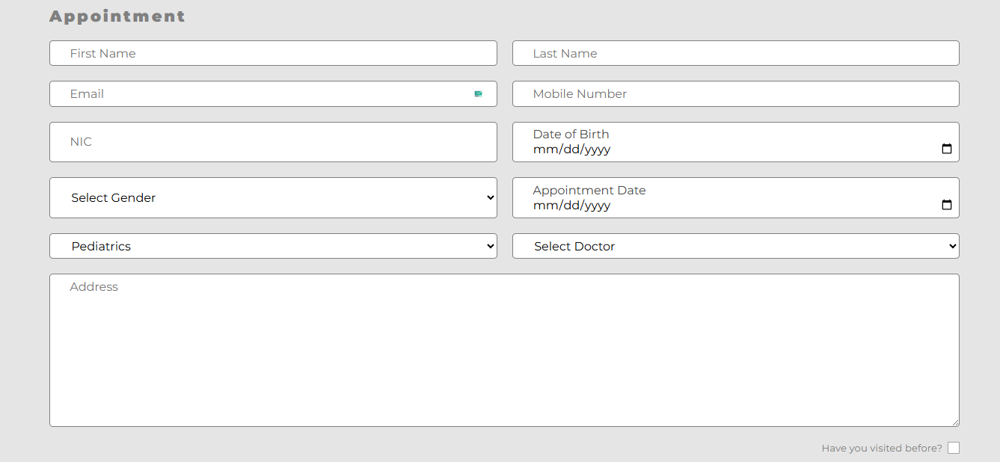

# 🏥 Hospital Management System

A full-stack **Hospital Management System** built with the **MERN stack** (MongoDB, Express.js, React.js, Node.js). This application streamlines hospital workflows, enabling doctors, patients, and staff to manage appointments, patient records, and messages efficiently. 

## 🚀 Features 
- **Role-Based User Authentication**  
  - Separate roles for **Doctor**, **Patient**, and **Admin**.  
  - Authentication and authorization managed using **JWT** and **bcrypt.js**.  
- **Messaging System**  
  - Enables users to exchange messages securely.  
- **Appointment Scheduling**  
  - Patients can schedule appointments with doctors.  
  - Doctors can view and manage their appointment schedules.  
- **Secure Token Management**  
  - Handles multiple **JWT tokens** for added security and functionality.  

## 🛠️ Tech Stack

| Technology             | Description                                           |
|------------------------|-------------------------------------------------------|
| **MongoDB**            | NoSQL database for storing application data          |
| **Express.js**         | Node.js framework for building RESTful APIs          |
| **React.js**           | Frontend library for building user interfaces        |
| **Node.js**            | JavaScript runtime for backend logic                 |
| **Mongoose**           | ODM (Object Data Modeling) library for MongoDB       |
| **JWT**                | Authentication using JSON Web Tokens                 |
| **Tailwind CSS / CSS** | Utility-first CSS framework for styling the frontend |
| **Cloudinary**         | Cloud-based image and video management service       | 

## 🔧 Installation & Setup

### Prerequisites

- Node.js and npm installed
- MongoDB Atlas or local MongoDB
- Git

### Create a .env file in the backend folder and add:

```bash
PORT=4000
MONGO_URL=your_mongodb_connection_string
CLIENT_URL=http://localhost:5173
DASHBOARD_URL=http://localhost:5174
JWT_SECRET_KEY=your_jwt_secret_key
JWT_EXPIRES=7d
COOKIE_EXPIRE=7
CLOUDINARY_CLOUD_NAME=your_cloudinary_cloud_name
CLOUDINARY_API_SECRET=your_cloudinary_api_key
CLOUDINARY_API_KEY=your_cloudinary_api_secret
```
## 📸 Screenshots

### Admin Dashboard


### Appointment Page



### Message Page


### Patient Registration Page


### Doctor Registration Page


### Admin Registration Page


